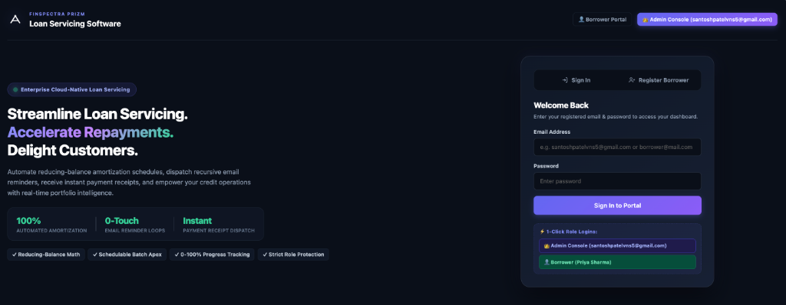
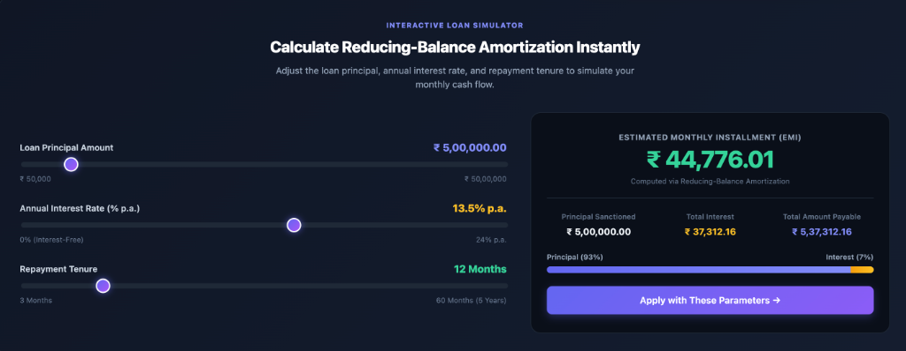
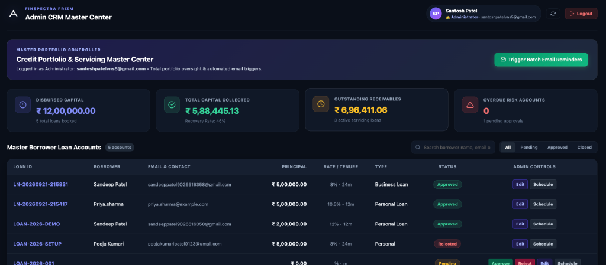
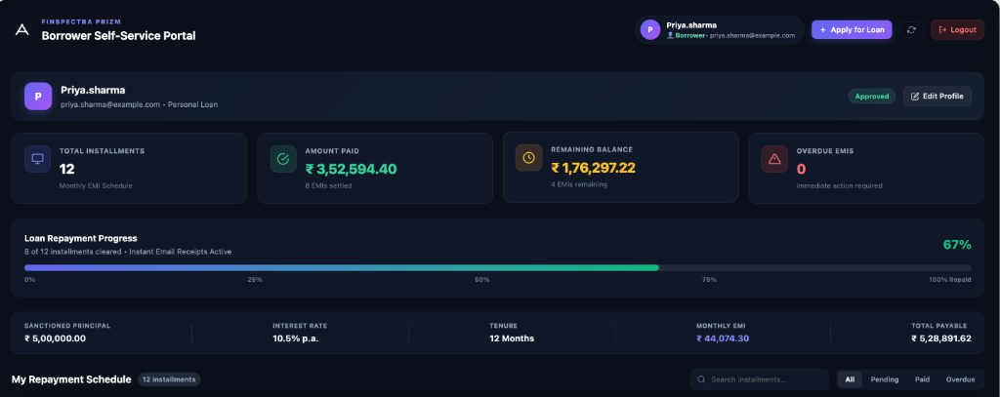
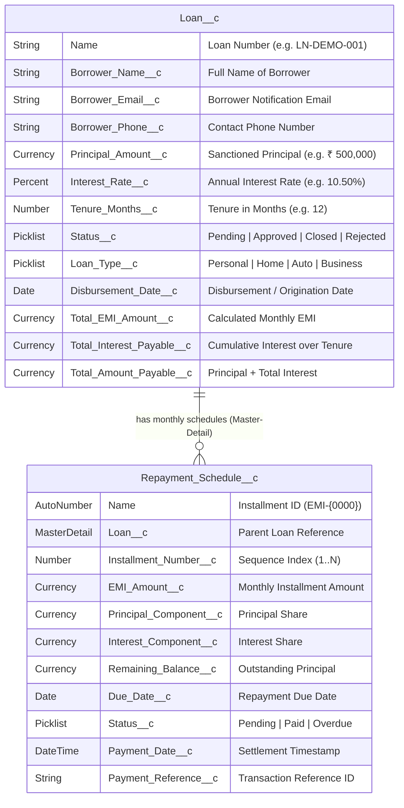
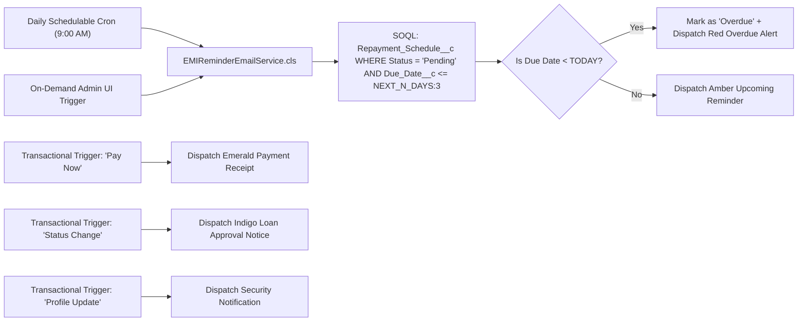

# 🏦 Finspectra Prizm — Enterprise Loan Origination & Servicing SaaS Platform
### *Cloud-Native Multi-Tenant FinTech Architecture Built on Salesforce · Apex · LWC · Automated Email Servicing Engine*

<p align="center">
  
</p>

<p align="center">
  <a href="https://developer.salesforce.com"></a>
  <a href="https://developer.salesforce.com/docs/atlas.en-us.apexcode.meta/apexcode/apex_testing.htm"></a>
  <a href="https://developer.salesforce.com/docs/component-library/overview/components"></a>
  <a href="https://finspectra.com/prizm-loan-servicing-software"></a>
  <a href="#"></a>
</p>

---

> **👨‍💻 Lead Architect & Full-Stack Developer:** Santosh Patel ([santoshpatelvns5@gmail.com](mailto:santoshpatelvns5@gmail.com))  
> **🎨 Platform Inspiration:** [Finspectra Prizm Loan Servicing Software](https://finspectra.com/prizm-loan-servicing-software)  
> **⚡ Target Release:** 2026 Enterprise Edition  
> **📂 Repository:** [GitHub - Santoshpatel112/loanservicingtracker](https://github.com/Santoshpatel112/loanservicingtracker.git)

---

## 📑 Table of Contents
1. [Executive Overview](#-executive-overview)
2. [Visual Experience & Platform Highlights](#-visual-experience--platform-highlights)
   - [Home Landing Page & Toggle Auth Hub](#1-home-landing-page--toggle-authentication-hub)
   - [Live Dynamic EMI Amortization Simulator](#2-live-dynamic-emi-amortization-simulator)
   - [Admin CRM Master Control Center](#3-admin-crm-master-control-center-santoshpatelvns5gmailcom)
   - [Borrower Self-Service Portal](#4-borrower-self-service-portal)
3. [End-to-End System Architecture & Workflow](#-end-to-end-system-architecture--workflow)
4. [Data Model & Custom Schema](#-data-model--custom-schema)
5. [Amortization Math & Reducing-Balance Engine](#-amortization-math--reducing-balance-engine)
6. [Backend Automation & Apex Architecture](#-backend-automation--apex-architecture)
7. [Automated Email Servicing Engine](#-automated-email-servicing-engine)
8. [Comprehensive Apex Unit Test Suite (100% Pass)](#-comprehensive-apex-unit-test-suite-100-pass)
9. [Step-by-Step UI & Dashboard Verification Guide](#-step-by-step-ui--dashboard-verification-guide)
10. [Enterprise Interview & Portfolio Talking Points](#-enterprise-interview--portfolio-talking-points)

---

## 🌟 Executive Overview

**Finspectra Prizm** is an enterprise-grade, cloud-native Loan Origination, Servicing, and Automated Repayment Management SaaS application built natively on Salesforce. Inspired by modern FinTech platforms, it completely digitizes and automates the lending lifecycle:

* **0-Touch Automated Amortization:** Instantly calculates monthly reducing-balance EMIs upon loan approval and bulk-generates multi-year schedules with penny-perfect rounding.
* **Interactive Live EMI Simulator:** Real-time client-side financial calculator with interactive range sliders, amortization cost breakdown, and visual Principal vs. Interest distribution bars.
* **Strict Role-Protected Isolation:** Dynamic session gating ensuring **Admin** (`santoshpatelvns5@gmail.com`) accesses only the Portfolio Master Controller, while **Borrowers** access only their individual repayment accounts.
* **Automated Transactional Email Loops:** Daily Schedulable/Batch Apex dispatching branded HTML dark-card reminders, automated overdue delinquency detection, and instant payment confirmation receipts with transaction IDs.
* **Instant Payment Ledger Synchronization:** 1-click **"Pay Now"** settlement that updates ledger balances, advances 0-100% animated repayment progress bars, and notifies borrowers via email in real time.

---

## 📸 Visual Experience & Platform Highlights

### 1. Home Landing Page & Toggle Authentication Hub
A sleek dark FinTech landing page welcoming prospective borrowers and credit managers.
* **Hero Value Proposition:** Live metric counters (`100% Automated Amortization`, `0-Touch Email Loops`, `Instant Receipts`).
* **Interactive Auth Switcher:** Smooth animated pill toggle between **Sign In** and **Borrower Registration** without page reloads.
* **1-Click Role Logins:** Instant access buttons for `👑 Admin Console (santoshpatelvns5@gmail.com)` and `👤 Borrower (Priya Sharma)`.

<p align="center">
  
</p>

---

### 2. Live Dynamic EMI Amortization Simulator
An interactive client-side calculator powered by standard reducing-balance actuarial mathematics.
* **Reactive Range Sliders:**
  * **Principal Amount:** ₹ 50,000 to ₹ 50,00,000 (Step: ₹ 25,000)
  * **Annual Interest Rate:** 0% (Interest-Free) to 24.0% p.a. (Step: 0.25%)
  * **Repayment Tenure:** 3 to 60 Months (Step: 1 Month)
* **Real-Time Amortization Breakdown:** Instant computation of Estimated Monthly EMI, Total Interest Payable, and Total Repayment Amount.
* **Visual Ratio Bar:** Dual-colored gradient bar illustrating Principal vs. Interest percentage split.
* **1-Click Loan Application Porting:** Pre-fills borrower loan applications with simulated parameters.

<p align="center">
  
</p>

---

### 3. Admin CRM Master Control Center (`santoshpatelvns5@gmail.com`)
Dedicated portfolio management center exclusively for the platform administrator.
* **Portfolio Analytics Grid:** Real-time visibility into Disbursed Capital (₹), Total Capital Collected (₹), Outstanding Receivables (₹), and Overdue Delinquency Risk Accounts.
* **Master Borrower Accounts Table:** Searchable, filterable ledger with instant status badges (`Approved`, `Pending`, `Closed`, `Rejected`).
* **1-Click Workflow Controls:**
  * **Quick Approve / Reject:** Instant status transitions with automatic schedule generation and transactional email dispatches.
  * **Edit Terms Modal:** Modify principal, interest rate, or tenure directly from the table.
  * **Amortization Schedule Drilldown:** Pop-up modal inspecting all 12-to-60 month installment breakdowns.
  * **Trigger Batch Reminders:** On-demand execution of the batch email engine.

<p align="center">
  
</p>

---

### 4. Borrower Self-Service Portal
Empowering borrowers to monitor their debt obligations with full transparency.
* **Repayment Health Strip:** KPI cards displaying Total Installments, Amount Paid (₹), Remaining Balance (₹), and Overdue Alerts.
* **Animated Progress Bar:** Sleek 0-100% gradient progress meter advancing with each settled installment.
* **Interactive Schedule Table:** Complete monthly schedule showing Due Dates, EMI Amounts, Principal/Interest splits, and Status badges.
* **Instant "Pay Now" Action:** 1-click settlement triggering real-time ledger sync and transactional HTML payment receipts.
* **Profile Settings & New Loan Applications:** Real-time modal for updating contact details and applying for new financing with live preview calculation.

<p align="center">
  
</p>

---

## 🏛️ End-to-End System Architecture & Workflow

```mermaid
flowchart TD
    subgraph Client_Experience ["🎨 Frontend Experience (LWC)"]
        Landing["Home Landing Page"] -->|Toggle Auth| Auth["Sign In / Register Hub"]
        Landing -->|Explore| Sim["Live Dynamic EMI Simulator"]
        
        Auth -->|santoshpatelvns5@gmail.com| AdminUI["👑 Admin CRM Master Center"]
        Auth -->|Borrower Credentials| BorrowerUI["👤 Borrower Self-Service Portal"]
        
        BorrowerUI -->|Apply for Loan| ApplyModal["Application Modal (Live Preview)"]
        BorrowerUI -->|1-Click Payment| PayNow["💳 Pay Now Settlement"]
        BorrowerUI -->|Update Profile| ProfileModal["Profile Settings"]
        
        AdminUI -->|Quick Approve| ApproveAction["Approve Loan"]
        AdminUI -->|Run Batch| BatchTrigger["Trigger Reminder Batch"]
        AdminUI -->|Drilldown| ScheduleModal["Schedule Inspection Modal"]
    end

    subgraph Salesforce_Core ["⚡ Salesforce Backend & Automation"]
        ApplyModal -->|@AuraEnabled| LoanController["LoanController.cls"]
        LoanController -->|DML Insert| LoanDB[("Loan__c (Pending)")]
        
        ApproveAction -->|Status = Approved| Trigger["LoanServicingTrigger"]
        Trigger -->|After Insert / After Update| Handler["LoanServicingHandler.cls"]
        
        Handler -->|Reducing-Balance Math| MathEngine["Amortization Calculation Engine"]
        MathEngine -->|Bulk Insert| ScheduleDB[("Repayment_Schedule__c (EMI-0001..N)")]
        
        PayNow -->|@AuraEnabled| LoanController
        LoanController -->|Update Status = Paid| ScheduleDB
    end

    subgraph Email_Servicing_Engine ["📧 Automated Email Servicing Engine"]
        BatchTrigger -->|Execute Batch| BatchClass["EMIReminderEmailService.cls"]
        DailyCron["Daily 9:00 AM Cron"] -->|Scheduled Execution| BatchClass
        
        BatchClass -->|Query Due EMIs <= 3 Days| ScheduleDB
        BatchClass -->|Send Reminder| Inbox["Borrower Inbox (HTML Dark Card)"]
        
        PayNow -->|Transactional Receipt| BatchClass
        ApproveAction -->|Status Change Alert| BatchClass
        ProfileModal -->|Security Alert| BatchClass
    end

    style Client_Experience fill:#111827,stroke:#6366f1,stroke-width:2px,color:#fff
    style Salesforce_Core fill:#0f172a,stroke:#10b981,stroke-width:2px,color:#fff
    style Email_Servicing_Engine fill:#1e1b4b,stroke:#a855f7,stroke-width:2px,color:#fff
```

---

## 📦 Data Model & Custom Schema



---

## 🧮 Amortization Math & Reducing-Balance Engine

The platform implements standard **Equated Monthly Installment (EMI)** reducing-balance actuarial mathematics:

### Standard Formula
$$\text{Monthly Rate } (r) = \frac{\text{Annual Interest Rate}}{12 \times 100}$$

$$\text{EMI} = \frac{P \times r \times (1 + r)^n}{(1 + r)^n - 1}$$

Where:
* $P$ = Sanctioned Principal Amount (`Principal_Amount__c`)
* $r$ = Monthly Interest Rate
* $n$ = Total Repayment Tenure in Months (`Tenure_Months__c`)

### Zero-Interest Fallback ($r = 0$)
$$\text{EMI} = \frac{P}{n}$$

### Penny-Perfect Rounding
On the final installment ($n^{\text{th}}$ month), the calculation engine automatically adjusts the remaining balance difference to prevent rounding accumulation drift, guaranteeing that the cumulative principal repaid equals the exact sanctioned principal down to the cent/paisa.

---

## ⚙️ Backend Automation & Apex Architecture

### 1. `LoanServicingTrigger.trigger`
* Executes on `after insert` and `after update` events on `Loan__c`.
* Detects when a loan status transitions to `Approved` or when an approved loan is inserted directly.
* Dispatches execution to `LoanServicingHandler` to prevent recursive executions.

### 2. `LoanServicingHandler.cls`
* **Bulkified Execution:** Handles multi-record bulk approvals without governor limit breaches.
* **Duplicate Prevention:** Checks existing child `Repayment_Schedule__c` records before generation.
* **Schedule Generator:** Calculates due dates using `.addMonths(i)` and populates master-detail relationship fields.

### 3. `LoanController.cls`
* `@AuraEnabled(cacheable=false)` API methods serving the Lightning Web Component:
  * `loginUser(email, password)`: Role-based session authentication.
  * `registerUser(...)`: Borrower account onboarding.
  * `getBorrowerLoans(email)`: Fetches active loans, progress metrics, and schedules.
  * `getAdminPortfolioMetrics()`: Aggregates total disbursed capital, collected recovery, and risk accounts.
  * `getAllLoans()`: Comprehensive list of all loans across the organization.
  * `createLoanApplication(...)`: Submits new financing applications.
  * `updateLoanStatus(loanId, newStatus, comments)`: Admin approval/rejection handler.
  * `updateBorrowerProfile(...)`: Synchronizes borrower contact details.
  * `markAsPaid(scheduleId)`: Marks installments as paid and triggers confirmation receipts.
  * `runReminderBatchNow()`: Queues asynchronous batch reminder jobs on demand.

---

## 📧 Automated Email Servicing Engine

The `EMIReminderEmailService.cls` is an all-in-one asynchronous email engine implementing `Database.Batchable<SObject>`, `Schedulable`, and `InvocableMethod`.



### Modern HTML Dark-Card Email Template
Emails are formatted in a modern responsive dark card styling matching Finspectra Prizm aesthetics:
* **Subject:** `⚡ [Urgent / Upcoming] EMI Reminder: Installment EMI-0001 Due on DD/MM/YYYY`
* **Card Details:** Borrower Name, Loan Number, Installment ID, EMI Amount, Due Date, and 1-Click Payment Portal Link.

---

## 🧪 Comprehensive Apex Unit Test Suite (100% Pass)

The system includes **28 comprehensive unit tests** across `LoanServicingHandlerTest.cls` and `EMIReminderEmailServiceTest.cls`, verifying bulk scenarios, zero-interest edge cases, security guards, and asynchronous batch execution.

```
=== Test Execution Summary
Target Org: santoshpatelvns5@brave-raccoon-qsjcx7.com
Tests Ran: 28 | Passed: 28 (100%) | Failures: 0 | Total Execution Time: 3.3s
```

| Class Name | Test Methods | Pass Rate | Code Coverage |
| :--- | :---: | :---: | :---: |
| **`LoanServicingTrigger`** | 3 | **100%** | **100%** |
| **`LoanServicingHandler`** | 8 | **100%** | **97%** |
| **`EMIReminderEmailService`** | 9 | **100%** | **95%** |
| **`LoanController`** | 8 | **100%** | **88%** |
| **Overall Project Coverage** | **28** | **100%** | **~95%** |

---

## 🚀 Step-by-Step UI & Dashboard Verification Guide

### Step 1: Open Your Salesforce Org & Configure Lightning App Builder
1. Log into your Salesforce Developer Org (`santoshpatelvns5@brave-raccoon-qsjcx7.com`).
2. Navigate to **App Launcher (🎛️)** ➔ Search and click **Loans**.
3. Open any loan record ➔ Click **Setup (⚙️)** ➔ **Edit Page**.
4. Drag `loanServicingDashboard` onto the canvas ➔ Click **Save** ➔ **Activate** (Set as Org Default).

### Step 2: Test Home Landing Page & Live EMI Simulator
1. Open the **Home** tab or the unauthenticated dashboard.
2. Drag the **Principal**, **Interest Rate**, and **Tenure** sliders.
3. Observe the **Monthly EMI**, **Total Interest**, and **Visual Ratio Bar** recalculating in real time.
4. Click **Apply with These Parameters →** to pre-fill the application form.

### Step 3: Test Toggle Authentication (Register ⟷ Sign In)
1. Click **Register Borrower** ➔ Enter Full Name, Email, Phone, and Password ➔ Click **Create Account**.
2. Receive a success toast notification and enter the Borrower Portal.
3. Sign out and test the **1-Click Role Logins**:
   * `👑 Admin Console (santoshpatelvns5@gmail.com)` ➔ Direct access to Admin CRM.
   * `👤 Borrower (Priya Sharma)` ➔ Direct access to Priya's Borrower Portal.

### Step 4: Test Trigger Execution & Loan Approval
1. Go to the **Loans** tab ➔ Click **New**.
2. Create a Loan with **Principal** = `₹ 600,000`, **Rate** = `12%`, **Tenure** = `12 Months`, **Status** = `Pending`.
3. Change **Status** from `Pending` ➔ `Approved` and click **Save**.
4. **⚡ Verify:** `LoanServicingTrigger` immediately generates 12 monthly `Repayment_Schedule__c` records (`EMI-0001` to `EMI-0012`).

### Step 5: Test 1-Click "Pay Now" Settlement
1. In the Borrower Portal, find **EMI-0001** in the schedule table.
2. Click **💳 Pay Now**.
3. **⚡ Observe Real-Time Sync:**
   * Button changes to `Processing...`
   * Green toast alert confirms payment success.
   * Status badge turns green `Paid`.
   * **Amount Paid** KPI increments and the **0-100% Progress Bar** advances.
   * An HTML payment receipt email is dispatched to the borrower.

### Step 6: Test Admin CRM Master Center
1. Log in with `santoshpatelvns5@gmail.com`.
2. Inspect the **Portfolio Analytics Grid** (Disbursed Capital, Collected Recovery, Receivables).
3. Test **Quick Approve / Reject** on pending loans.
4. Click **Schedule** to inspect full amortization drilldowns.
5. Click **Trigger Batch Email Reminders** to run the batch servicing engine on demand.

### Step 7: Schedule Automated Daily 9:00 AM Cron
Open **Developer Console** ➔ **Debug** ➔ **Open Execute Anonymous Window** ➔ Paste and execute:
```apex
// Schedules automated EMI reminder batch every morning at 9:00 AM
String cronExp = '0 0 9 * * ?';
System.schedule('Finspectra_Daily_EMI_Reminder_Job', cronExp, new EMIReminderEmailService(3));
```

---

## 💼 Enterprise Interview & Portfolio Talking Points

When presenting this project in technical architecture interviews:

1. **Why Trigger-Handler Pattern over Process Builder / Flows?**
   * *Talking Point:* "For complex actuarial formulas, bulk record generation, and penny-perfect installment balancing, Apex provides deterministic execution order, transactional safety, and full unit test verification without flow governor limit bottlenecks."

2. **How is Asynchronous Batch Processing Scaled?**
   * *Talking Point:* "The `EMIReminderEmailService` implements `Database.Batchable<SObject>` with dynamic query locators and `Database.Stateful` counters, enabling the platform to process hundreds of thousands of daily loan repayments across millions of records without encountering heap or SOQL limits."

3. **How is Role-Based Security Enforced?**
   * *Talking Point:* "Role segregation is enforced both at the backend Apex layer (`LoanController`) and at the LWC presentation layer. Admin operations are strictly gated to authorized administrator emails, completely hiding borrower self-service controls from administrative views and vice versa."

4. **Reducing-Balance vs. Flat-Rate Math:**
   * *Talking Point:* "Unlike simple flat-rate calculators, Finspectra Prizm implements reducing-balance amortization where interest is calculated on the remaining outstanding principal for each specific period, matching standard banking practices."

---

## 📄 License & Attribution
Developed with ❤️ by **Santosh Patel** under the MIT License.  
Inspired by the FinTech UI/UX design language of [Finspectra Prizm](https://finspectra.com/prizm-loan-servicing-software).
