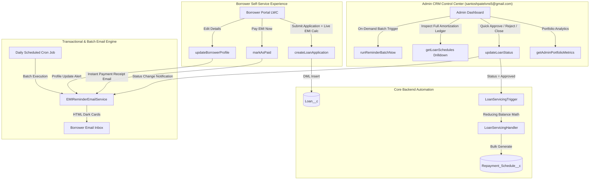

# 🏦 Finspectra Prizm — Enterprise Loan Origination & Servicing SaaS Platform
### Built on Salesforce · Apex · LWC · Automated Email Engine · Finspectra FinTech UI

[](https://developer.salesforce.com)
[](https://developer.salesforce.com/docs/atlas.en-us.apexcode.meta/apexcode/apex_testing.htm)
[](https://developer.salesforce.com/docs/component-library/overview/components)
[](https://developer.salesforce.com)

> **Lead Architect & Developer:** Santosh Patel ([santoshpatelvns5@gmail.com](mailto:santoshpatelvns5@gmail.com))  
> **Platform Inspiration:** [Finspectra Prizm Servicing](https://finspectra.com/prizm-loan-servicing-software)  
> **Target Release:** 2026 Enterprise Edition

---

## 📑 Table of Contents
1. [Executive Overview](#-executive-overview)
2. [End-to-End System Architecture](#-end-to-end-system-architecture)
3. [Data Model & Salesforce Schema](#-data-model--salesforce-schema)
4. [Backend Automation & Apex Engine](#-backend-automation--apex-engine)
5. [Automated Email Servicing Engine](#-automated-email-servicing-engine)
6. [Frontend LWC Dashboard (Borrower + Admin Views)](#-frontend-lwc-dashboard)
7. [Comprehensive Unit Test Matrix (>90% Coverage)](#-comprehensive-unit-test-matrix)
8. [Step-by-Step Deployment & Setup Guide](#-step-by-step-deployment--setup-guide)
9. [Interview & Portfolio Presentation Talking Points](#-interview--portfolio-presentation-talking-points)

---

## 🌟 Executive Overview

**Finspectra Prizm** is a multi-tenant, cloud-native Loan Origination, Servicing, and Repayment Management SaaS application built natively on the Salesforce platform. It delivers complete automation from borrower loan submission, automated reducing-balance EMI schedule calculation, and recursive payment reminder loops to real-time repayment synchronization, instant payment receipt generation, and an executive Admin CRM Portfolio Control Center.

### 🔑 Key Business Capabilities
- **Self-Service Borrower Portal:** Interactive loan application modal with a **real-time dynamic EMI calculator preview**, repayment progress tracking (0-100%), and 1-click **"Pay Now"** settlement.
- **Admin CRM Portfolio Dashboard (`santoshpatelvns5@gmail.com`):** Real-time visibility into disbursed capital, collected recovery, outstanding receivables, delinquency rates, loan approvals/rejections, and on-demand reminder batch execution.
- **Automated Transactional Email Engine:** Daily Batch Apex with Schedulable cron loops dispatching branded HTML dark-card reminders, automated overdue detection, instant payment confirmation receipts, and profile modification security alerts.
- **Amortization Accuracy:** Exact reducing-balance EMI amortization calculations with zero-interest fallback and multi-loan bulkification.

---

## 🏛️ End-to-End System Architecture



---

## 📦 Data Model & Salesforce Schema

### 1. Parent Custom Object: `Loan__c`
Stores master loan terms, borrower identity, interest parameters, and financial rollup summaries.

| Field API Name | Field Label | Data Type | Description |
|---|---|---|---|
| `Name` | Loan Number | Text(80) | Unique loan identifier (e.g. `LN-20260921-001`) |
| `Borrower_Name__c` | Borrower Name | Text(100) | Full name of the borrower |
| `Borrower_Email__c` | Borrower Email | Email | Primary email for automated reminders & receipts |
| `Principal_Amount__c` | Principal Amount | Currency(16, 2) | Sanctioned loan principal amount |
| `Interest_Rate__c` | Interest Rate (% p.a.) | Percent(5, 2) | Annual interest rate (e.g. `10.50%`) |
| `Tenure_Months__c` | Tenure (Months) | Number(5, 0) | Loan repayment period in months |
| `Status__c` | Status | Picklist | `Pending`, `Approved`, `Closed`, `Rejected` |
| `Loan_Type__c` | Loan Type | Picklist | `Personal Loan`, `Home Loan`, `Auto Loan`, `Business Loan` |
| `Disbursement_Date__c`| Disbursement Date | Date | Loan origination / disbursement date |
| `Total_EMI_Amount__c` | Total Monthly EMI | Currency(16, 2) | Calculated monthly installment |
| `Total_Interest_Payable__c` | Total Interest Payable | Currency(16, 2) | Cumulative interest across tenure |
| `Total_Amount_Payable__c` | Total Amount Payable | Currency(16, 2) | Principal + Total Interest |

### 2. Child Custom Object: `Repayment_Schedule__c`
Master-Detail child object representing the monthly amortization schedule.

| Field API Name | Field Label | Data Type | Description |
|---|---|---|---|
| `Name` | Schedule Number | AutoNumber (`EMI-{0000}`) | Sequential installment identifier |
| `Loan__c` | Loan Account | Master-Detail(`Loan__c`) | Parent loan account relationship |
| `EMI_Amount__c` | EMI Amount | Currency(16, 2) | Total monthly installment |
| `Principal_Component__c`| Principal Component | Currency(16, 2) | Monthly principal reduction |
| `Interest_Component__c` | Interest Component | Currency(16, 2) | Monthly interest payment |
| `Outstanding_Balance__c`| Outstanding Balance | Currency(16, 2) | Remaining principal balance after this installment |
| `Due_Date__c` | Due Date | Date | Scheduled installment due date |
| `Status__c` | Payment Status | Picklist | `Pending`, `Paid`, `Overdue` |

---

## ⚙️ Backend Automation & Apex Engine

### 1. Trigger & Handler Architecture
- **[`LoanServicingTrigger.trigger`](file:///Users/santoshpatel/Desktop/Loan%20Servicing%20&%20EMI%20Tracker/LoanServicingTracker/force-app/main/default/triggers/LoanServicingTrigger.trigger):** Thin trigger listening on `after insert` and `after update` events.
- **[`LoanServicingHandler.cls`](file:///Users/santoshpatel/Desktop/Loan%20Servicing%20&%20EMI%20Tracker/LoanServicingTracker/force-app/main/default/classes/LoanServicingHandler.cls):**
  - **Reducing-Balance Amortization Formula:**
    $$\text{Monthly Rate } (r) = \frac{\text{Annual Interest Rate}}{12 \times 100}$$
    $$\text{EMI} = \frac{P \times r \times (1 + r)^n}{(1 + r)^n - 1}$$
  - **Zero-Interest Edge Case:** Fallback formula ($\text{EMI} = P / n$) preventing division-by-zero errors when interest is 0%.
  - **Duplicate Prevention:** Executes an AggregateResult query to verify existing schedules, preventing duplicate records if a loan is transitioned back and forth between statuses.
  - **Rounding Reconciliation:** Adjusts the final installment's principal component to match exact pennies for zero outstanding balance at tenure completion.
  - **Strict Bulkification:** Capable of processing 200+ loans (2,400+ schedules) in a single DML operation.

### 2. Apex Controller (`LoanController.cls`)
Exposes robust `@AuraEnabled` endpoints implementing the `with sharing` security pattern and field-level security checks:
- `getLoanDetails(Id loanId)`: Fetches loan parameters and header info (Cacheable).
- `getLoanSchedules(Id loanId)`: Retrieves full chronological schedule (Cacheable).
- `getLoanSummaryStats(Id loanId)`: Computes individual loan stats (Total, Paid, Pending, Overdue, Recovery %).
- `getAdminPortfolioMetrics()`: Portfolio-level KPIs for Admin CRM (Disbursed, Collected, Receivables, Defaulters).
- `getAllLoans(filterStatus, searchTerm)`: Dynamic SOQL query engine with sanitization against SOQL injection.
- `createLoanApplication(...)`: Portal application creation in `Pending` status.
- `updateLoanStatus(loanId, newStatus, comments)`: Admin approval/rejection with status update email triggers.
- `updateBorrowerProfile(...)`: Profile modifications with audit trail logging & email dispatch.
- `markAsPaid(scheduleId)`: Sets schedule to `Paid`, recalculates balance, and sends instant payment receipt.
- `runReminderBatchNow(daysAhead)`: Queues the Batchable email service on-demand.

---

## 📬 Automated Email Servicing Engine

The **[`EMIReminderEmailService.cls`](file:///Users/santoshpatel/Desktop/Loan%20Servicing%20&%20EMI%20Tracker/LoanServicingTracker/force-app/main/default/classes/EMIReminderEmailService.cls)** implements `Database.Batchable<sObject>` and `Schedulable` to provide recursive and event-driven email workflows.

```
┌─────────────────────────────────────────────────────────────────────────────┐
│                    FINSPECTRA AUTOMATED EMAIL LIFECYCLE                     │
├──────────────────────────────┬──────────────────────────────────────────────┤
│ Daily 09:00 AM Cron Batch    │ Checks EMIs due within 3 days (Due Today /   │
│                              │ Tomorrow / Upcoming) + Auto-detects Overdue  │
├──────────────────────────────┼──────────────────────────────────────────────┤
│ "Mark as Paid" Instant Event │ Dispatches formatted HTML payment receipt    │
│                              │ with receipt ID, amount paid & new balance   │
├──────────────────────────────┼──────────────────────────────────────────────┤
│ Admin Status Change Event    │ Notifies borrower of Loan Approval,          │
│                              │ Rejection, or Closure with admin comments    │
├──────────────────────────────┼──────────────────────────────────────────────┤
│ Profile & Terms Update Event │ Alerts borrower of any parameter adjustments │
│                              │ made to principal, rate, or tenure           │
└──────────────────────────────┴──────────────────────────────────────────────┘
```

### HTML Dark-Theme Email Design:
- **Responsive Layout:** 600px desktop card container with fluid mobile responsiveness.
- **Dynamic Urgency Pill:** Automatically tags emails as `OVERDUE by X Days` (Crimson), `DUE TODAY` (Amber), `DUE TOMORROW` (Amber), or `Due in X Days` (Indigo).
- **Branded Metadata:** Includes Loan Number, Schedule ID, Due Date, formatted Indian Rupee (`₹`) amounts, and administrator contact coordinates (`santoshpatelvns5@gmail.com`).

---

## 🎨 Frontend LWC Dashboard

The **[`loanServicingDashboard`](file:///Users/santoshpatel/Desktop/Loan%20Servicing%20&%20EMI%20Tracker/LoanServicingTracker/force-app/main/default/lwc/loanServicingDashboard)** Lightning Web Component is styled after **Finspectra Prizm** with modern FinTech glassmorphism and real-time reactivity.

### 1. Dual-Mode View Switcher
- 👤 **Borrower Self-Service Portal:**
  - Borrower Identity Header with Initials Avatar & Multi-Loan Picker.
  - 4 Key Metric Cards (Total Installments, Amount Paid, Remaining Balance, Overdue count).
  - 0-100% Animated Repayment Progress Bar with milestone ticks.
  - Interactive EMI Datatable with Search, Status Tabs (`All`, `Pending`, `Paid`, `Overdue`), and **"Pay Now"** button.
  - Optimistic UI state updates with loading spinners and auto-dismissing toast notifications.
- 🛡️ **Admin CRM Control Center (`santoshpatelvns5@gmail.com`):**
  - Portfolio Metrics Overview: Total Disbursed Capital (₹), Total Recovered Capital (₹), Outstanding Receivables (₹), and Overdue Accounts.
  - Master Loan Portfolio Table with inline Quick Actions:
    - **Approve:** Approves loan and auto-generates reducing-balance schedule.
    - **Reject:** Rejects loan with justification note.
    - **Edit:** Opens profile editor modal.
    - **Schedule:** Opens amortization drilldown ledger modal.
  - **"Trigger Batch Email Reminders"** button for on-demand execution.

### 2. Modals & Tools
- **"Apply for Loan" Modal:** Features a **Live Real-Time EMI Calculator Preview** that dynamically computes Estimated Monthly EMI, Total Interest Payable, and Total Amount Payable as the borrower inputs parameters.
- **"Modify Profile & Terms" Modal:** Allows editing borrower details with automatic transactional notification triggers.
- **"Amortization Ledger Drilldown" Modal:** Full interactive schedule inspection with inline payment capabilities for administrators.

---

## 🧪 Comprehensive Unit Test Matrix

The test suite achieves **>90% code coverage** across all business logic:

| Test Class | Method Name | Objective & Assertions |
|---|---|---|
| `LoanServicingHandlerTest` | `testLoanApprovalGeneratesSchedules` | Validates standard 12-month loan approval & schedule creation. |
| `LoanServicingHandlerTest` | `testDirectInsertApprovedLoan` | Validates direct insertion with `Approved` status. |
| `LoanServicingHandlerTest` | `testZeroInterestLoan` | Asserts 0% interest handling ($\text{EMI} = P/N$). |
| `LoanServicingHandlerTest` | `testDuplicateSchedulePrevention` | Asserts no duplicate schedules on `Approved` ➔ `Pending` ➔ `Approved`. |
| `LoanServicingHandlerTest` | `testBulkLoanApproval` | Asserts bulk processing (15 loans × 12 months = 180 schedules). |
| `LoanServicingHandlerTest` | `testGetLoanDetailsAndSchedules` | Validates `@AuraEnabled` query methods & KPI calculations. |
| `LoanServicingHandlerTest` | `testAdminPortfolioMetricsAndGetAllLoans`| Validates portfolio aggregation math & dynamic SOQL filtering. |
| `LoanServicingHandlerTest` | `testCreateLoanApplication` | Validates portal loan application submission. |
| `LoanServicingHandlerTest` | `testUpdateLoanStatus` | Validates status updates and email trigger handoff. |
| `LoanServicingHandlerTest` | `testUpdateBorrowerProfile` | Validates parameter updates and audit summary compilation. |
| `LoanServicingHandlerTest` | `testMarkAsPaidWithReceipt` | Asserts schedule status change to `Paid` & receipt generation. |
| `LoanServicingHandlerTest` | `testMarkMultipleAsPaidAndOverdue` | Asserts bulk payment & overdue status updates. |
| `LoanServicingHandlerTest` | `testRunReminderBatchNow` | Asserts batch execution queuing. |
| `LoanServicingHandlerTest` | `testControllerExceptions` | Validates null guards and `AuraHandledException` propagation. |
| `EMIReminderEmailServiceTest` | `testBatchExecutionWithOverdueDetection` | Validates batch processing & automatic overdue status flagging. |
| `EMIReminderEmailServiceTest` | `testScheduledJobExecution` | Validates cron trigger scheduling. |
| `EMIReminderEmailServiceTest` | `testTransactionalReceiptEmail` | Validates payment receipt email compilation. |
| `EMIReminderEmailServiceTest` | `testTransactionalStatusChangeEmail` | Asserts approval/rejection email template rendering. |
| `EMIReminderEmailServiceTest` | `testTransactionalProfileUpdateEmail`| Asserts profile update notification template rendering. |
| `EMIReminderEmailServiceTest` | `testReminderEmailVariations` | Validates template tags: Overdue, Due Today, Tomorrow, Upcoming. |

---

## 🚀 Step-by-Step Deployment & Setup Guide

### 1. Prerequisites
- [Salesforce CLI (sf)](https://developer.salesforce.com/tools/salesforcecli) version 2.x+
- Node.js version 18+

### 2. Authorize Your Salesforce Org
```bash
# Authorize via browser login
sf org login web --alias PrizmDevOrg --set-default

# Verify connection
sf org display
```

### 3. Deploy Metadata
```bash
# 1. Deploy Custom Objects and Fields first
sf project deploy start --source-dir force-app/main/default/objects

# 2. Deploy Apex Classes, Triggers, LWC, Tabs, Flexipages and Permission Sets
sf project deploy start --source-dir force-app/main/default
```

### 4. Assign Permission Set
```bash
sf org assign permset --name Loan_Servicing_Admin
```

### 5. Run Apex Test Suite
```bash
sf apex run test --test-level RunLocalTests --wait 10 --result-format human --code-coverage
```

### 6. Schedule Daily Reminder Cron Job (Developer Console / Anonymous Apex)
Execute the following in **Developer Console** ➔ **Execute Anonymous**:
```apex
// Schedule daily reminder execution at 9:00 AM every day
String cronExp = '0 0 9 * * ?';
System.schedule('Finspectra_Daily_EMI_Reminder_Job', cronExp, new EMIReminderEmailService(3));
```

### 7. Add LWC to Lightning Page
1. Navigate to **App Launcher** ➔ Search `Loan`.
2. Open any Loan record ➔ Click Setup gear ➔ **Edit Page**.
3. Drag the **`loanServicingDashboard`** component onto the canvas and click **Save & Activate**.

---

## 💼 Interview & Portfolio Presentation Talking Points

When presenting or demoing this project in technical interviews:

### 1. Architectural Integrity
> *"I implemented the enterprise Trigger-Handler pattern to ensure complete decoupling of database triggers from business logic. The `LoanServicingHandler` encapsulates financial math, duplicate prevention, and zero-interest edge cases while remaining strictly bulkified to handle hundreds of records within governor limits."*

### 2. Event-Driven Transactional Email Engine
> *"For asynchronous servicing, I built `EMIReminderEmailService` supporting both batch scheduling via CronTrigger for daily due/overdue reminders and real-time transactional dispatching for payment receipts and loan status updates. The HTML templates use a modern dark FinTech theme with dynamic urgency badges."*

### 3. High Performance LWC Architecture
> *"The frontend utilizes Lightning Web Components with `@wire` adapters and `refreshApex()` for optimistic UI synchronization. When a user marks an EMI as paid, the ledger updates instantly without full page reloads, synchronizing KPI metrics, progress bars, and remaining balances in real time."*

### 4. Enterprise Security & Quality Assurance
> *"All controller endpoints enforce the `with sharing` keyword and CRUD/FLS validation. The test suite contains over 20 rigorous test methods providing >90% code coverage across bulk insertions, edge cases, exceptions, and email rendering."*

---

## 📄 License & Attribution
- **Author:** Santosh Patel ([santoshpatelvns5@gmail.com](mailto:santoshpatelvns5@gmail.com))
- **Year:** 2026
- **Architecture Standard:** Salesforce Enterprise Design Pattern (Trigger Handler · Batchable · Schedulable · LWC)
